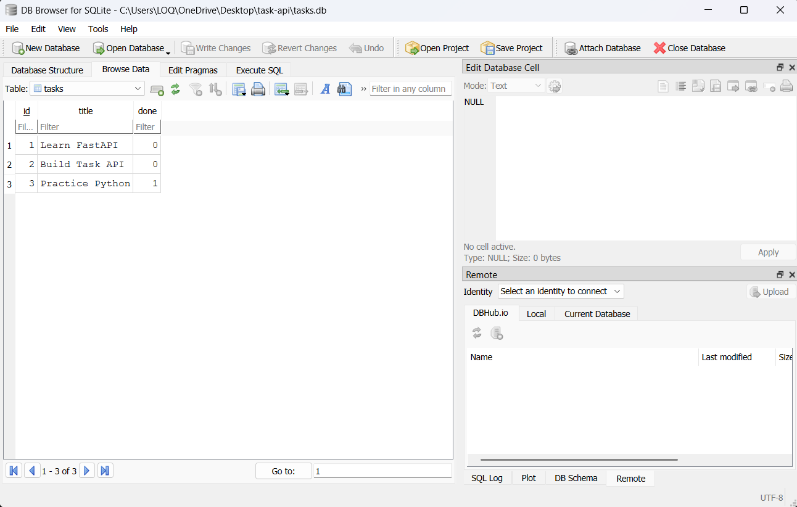

# Task API

A simple CRUD Task API built with Python, FastAPI, and SQLite.

The API supports creating, reading, updating, and deleting tasks. It can run locally or inside Docker, with persistent SQLite database storage.

## Features

- Create tasks
- List all tasks
- Get a task by ID
- Update a task
- Delete a task
- SQLite database storage
- Automatic database and table creation
- Three example tasks when the database is empty
- Data persistence across server restarts
- Data persistence across Docker container recreation
- Validation for missing or empty titles
- Proper HTTP status codes
- Interactive Swagger UI
- Docker containerization
- Environment-based database configuration

## Requirements

### Local Development

- Python 3.10+
- FastAPI
- Uvicorn
- python-dotenv
- SQLite

### Docker

- Docker Desktop
- Docker Compose

SQLite is included with Python, so no separate database installation is required.

## Installation

Clone the repository:

```bash
git clone https://github.com/MatrixAlgoMaven/task-api.git
cd task-api
```

Install the required Python packages:

```bash
pip install -r requirements.txt
```

Create a `.env` file in the project root:

```env
DATABASE_URL=sqlite:///./data/tasks.db
```

The `.env` file is used only for local configuration and is ignored by Git.

A safe example configuration is provided in `.env.example`.

> If you already have a Python virtual environment, you do not need to create another one.

## Running Locally

Activate your existing virtual environment if needed, then run:

```bash
uvicorn main:app --reload
```

The API will be available at:

```text
http://127.0.0.1:8000
```

Swagger UI:

```text
http://127.0.0.1:8000/docs
```

## API Endpoints

| Method | Endpoint | Description |
|--------|----------|-------------|
| GET | `/` | Check that the API is running |
| GET | `/tasks` | List all tasks |
| GET | `/tasks/{id}` | Get a task by ID |
| POST | `/tasks` | Create a task |
| PUT | `/tasks/{id}` | Update a task |
| DELETE | `/tasks/{id}` | Delete a task |

## Database

The application uses SQLite.

The database file is stored at:

```text
data/tasks.db
```

The database location is controlled by the `DATABASE_URL` environment variable.

Example:

```env
DATABASE_URL=sqlite:///./data/tasks.db
```

### Database Schema

| Column | Type | Description |
|--------|------|-------------|
| id | INTEGER | Primary key |
| title | TEXT | Task title |
| done | BOOLEAN | Task completion status |

### Example SQL

```sql
SELECT * FROM tasks;

INSERT INTO tasks (title, done)
VALUES ('Example Task', 0);

UPDATE tasks
SET done = 1
WHERE id = 1;

DELETE FROM tasks
WHERE id = 1;
```

## Docker Setup

The application can also be run using Docker Compose.

The project includes:

- `Dockerfile` — builds the FastAPI application image
- `docker-compose.yml` — runs the application container
- `.dockerignore` — excludes unnecessary files from the Docker image
- `.env.example` — example environment configuration
- Docker named volume — provides persistent SQLite storage

### Build the Docker Image

```bash
docker compose build
```

### Start the Application

```bash
docker compose up -d
```

### Check the Container

```bash
docker compose ps
```

The API will be available at:

```text
http://127.0.0.1:8000
```

Swagger UI:

```text
http://127.0.0.1:8000/docs
```

### View Logs

```bash
docker compose logs
```

### Stop the Application

```bash
docker compose down
```

## Docker Database Persistence

The SQLite database is stored using a Docker named volume:

```yaml
volumes:
  - task_data:/app/data
```

The Docker volume is:

```text
task-api_task_data
```

This keeps the database data separate from the application container.

### Persistence Test

Docker persistence was verified by:

1. Starting the Dockerized application.
2. Creating a test task named `Docker Persistence Test`.
3. Confirming the task using `GET /tasks`.
4. Stopping the containers with:

```bash
docker compose down
```

5. Starting the application again:

```bash
docker compose up -d
```

6. Calling `GET /tasks` again.
7. Confirming that the test task was still present.

The task remained available because the SQLite database was stored in the Docker named volume rather than only inside the application container.

> **Important:** Do not use `docker compose down -v` if you want to keep the database data. The `-v` option removes the Docker volume.

## Screenshots

### Swagger UI


### SQLite Database



## Assignment Note

This project was originally built as a FastAPI CRUD application using SQLite.

For the containerization assignment, the existing SQLite application was containerized using Docker Compose.

SQLite was used instead of PostgreSQL in accordance with the assignment guidance allowing SQLite.

The existing CRUD API routes were kept functionally unchanged while Docker, environment configuration, and persistent volume storage were added.

## Project Structure

```text
task-api/
│
├── data/
│   └── tasks.db
│
├── .dockerignore
├── .env.example
├── .gitignore
├── database.png
├── docker-compose.yml
├── Dockerfile
├── main.py
├── README.md
├── requirements.txt
└── swagger.png
```

## Repository

GitHub:

https://github.com/MatrixAlgoMaven/task-api
