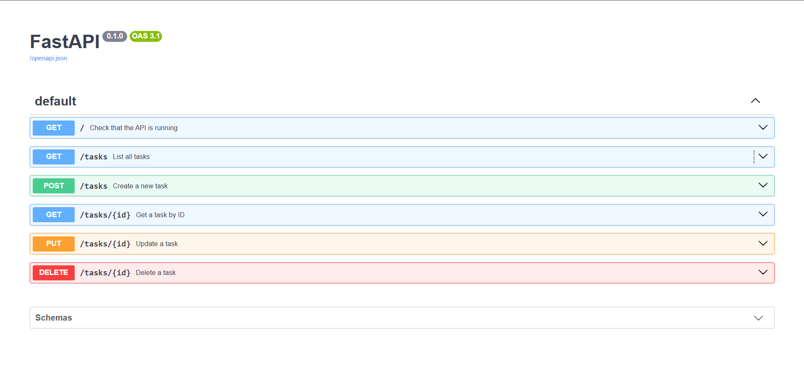

# Task API

A simple CRUD Task API built with Python and FastAPI.

The API stores tasks in an in-memory list and supports creating, reading, updating, and deleting tasks.

## Features

- Create tasks
- List all tasks
- Get a task by ID
- Update a task
- Delete a task
- Validation for missing or empty titles
- Proper HTTP status codes
- Interactive Swagger UI documentation

## Requirements

- Python 3.10+
- FastAPI
- Uvicorn

## Installation and Setup

Clone the repository:

```bash
git clone https://github.com/MatrixAlgoMaven/task-api.git
cd task-api
```

Create and activate a virtual environment:

### Windows

```bash
python -m venv venv
venv\Scripts\activate
```

Install dependencies:

```bash
pip install "fastapi[standard]"
```

Start the server:

```bash
fastapi dev main.py
```

The API will be available at:

```text
http://localhost:8000
```

Swagger UI:

```text
http://localhost:8000/docs
```

## API Endpoints

| Method | Endpoint | Description | Success |
|---|---|---|---|
| GET | `/tasks` | List all tasks | 200 |
| GET | `/tasks/{id}` | Get a task by ID | 200 |
| POST | `/tasks` | Create a new task | 201 |
| PUT | `/tasks/{id}` | Update a task | 200 |
| DELETE | `/tasks/{id}` | Delete a task | 204 |

## Error Responses

| Status | Description |
|---|---|
| 400 | Invalid or missing task title |
| 404 | Task not found |

## Example: Get a Task

```bash
curl -i http://localhost:8000/tasks/1
```

Example response:

```text
HTTP/1.1 200 OK
content-type: application/json

{
  "id": 1,
  "title": "Learn FastAPI",
  "done": false
}
```

## Swagger UI

The API includes interactive Swagger UI documentation.

Open:

http://localhost:8000/docs

Use Swagger UI to create, read, update, and delete tasks without using curl.

### Swagger Screenshot

_Add your Swagger UI screenshot here._

## Project Structure

```text
task-api/
├── main.py
├── README.md
├── .gitignore
└── venv/
```

## Notes

This project uses an in-memory list for task storage. Data is reset whenever the server restarts.

Built with Python and FastAPI.

### Swagger Screenshot

